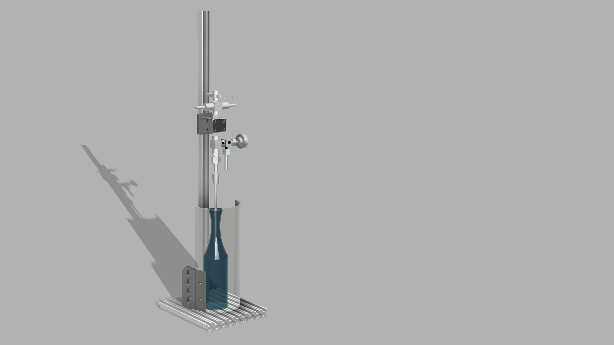
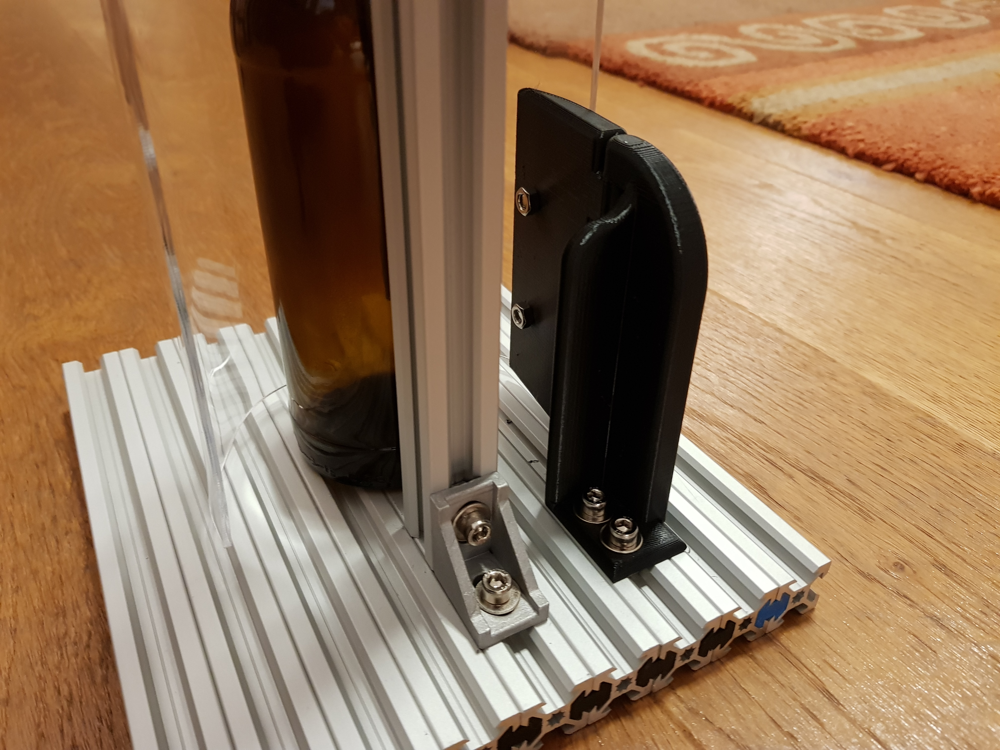
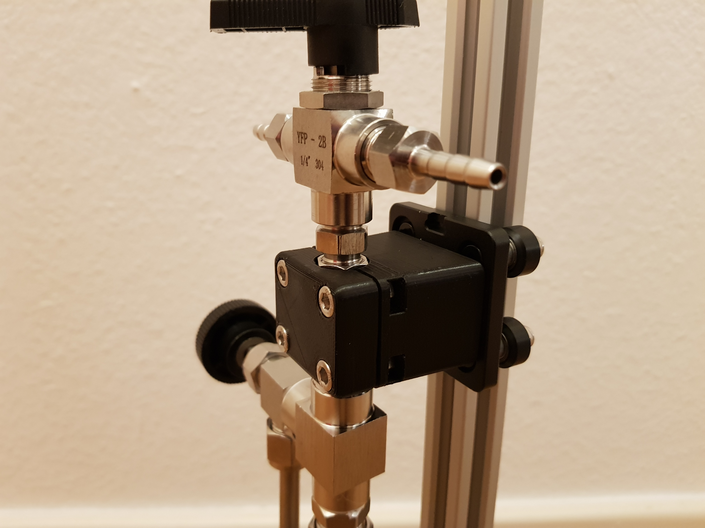
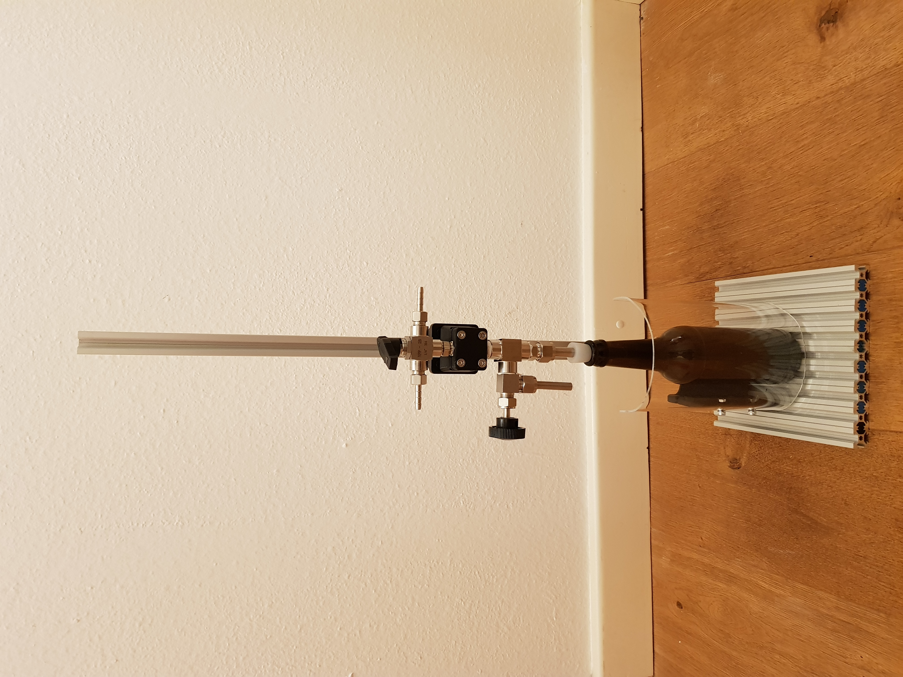

# Counter Pressure Filler Mount
Source Files and Documentation for a Mount for the Cheap Counter Pressure Fillers

# Disclaimer
I assume a certain degree of self awareness, responsibility and common sense of the reader. Use these files and resources at your own risk. I am not responsible for any damage to humans and or things that may arise when using a counter pressure filler with this rig. I also do not guarantee any degree of completeness for the provided documents and files.

# Tools and Resources needed
* 3D Printer (or someone you know that has a 3D Printer), I used PETG and a Prusa MK3s, 20% infill, with supports
* Laser Cutter (optional)
* Small screwdriver to clean up 3D print
* Allen Keys
* Hot Glue Gun (or wood glue?)
* Heat Gun to form the shield
* Hammer
* 5.5mm drill bit & drill

# Bill of Material
Links for convenience, no affiliation. OpenBuilds 2020 V-Slot Profiles are used as structural base.

| Product | Link | Amount |
| --- | --- | --- |
| Counter Pressure Filler | https://www.amazon.de/gp/product/B07TQT33DP | 1 |
| Openbuilds Gantry Plate | https://www.amazon.de/dp/B07SLZFWKF | 1 |
| Angle for 2020 Openbuilds Profiles + Nuts + Bolts | gone.., maybe print it https://www.thingiverse.com/thing:105900 | 1 |
| Nuts for 2020 Openbuilds Profile | gone.., also maybe print it https://www.thingiverse.com/thing:3050607 | 2 |
| M5x10 | Hardware Store | 4 |
| M5 Nut | Hardware Store | 6 |
| M5 Nut | Hardware Store | 6 |
| 2020 OpenBuilds Profile, 20cm | https://shop.myhobby-cnc.de/bauteile/mechanische-bauteile/profile/66/openbuilds-profil-20x20mm | 9 |
| 2020 OpenBuilds Profile, 70cm | https://shop.myhobby-cnc.de/bauteile/mechanische-bauteile/profile/66/openbuilds-profil-20x20mm | 1 |
| 2mm Plexiglas, 25cm x 185cm | Hardware Store? | 1 |
| 3mm A3 MDF sheet or plywood | Hardware Store? | 1, maybe 2 to be sure |

# Parts to Print

## 1x Shield Mount
This part can be printed as a whole, standing up. A little carfull bending will losen the hinge. Clean it with something pointy like a flat head screwdriver.

## 1x Bottom and Top Clamp
The notches in the top clamp part need to be printed with support structures and then cleaned with a screwdrive or something hook-y. This is tedious, but it did fit for me in the end.

## 16x OpenBuilds Connector
https://www.thingiverse.com/thing:2160166
Maybe you need to scale this, see instructions!

# Assemble

## Base
Use the OpenBuild Connectors and a little persuasian with a hammer to connect the profiles to form a base.

## Stem
Mount the stem with the angle at the 5th shorter profile.

## Shield Mount
Mount the shield mount with two nuts and bolts at the 7th profile.

## Shield
Drill the holes according to the drawing or use a laser cuttter and the provided DXF file.
Cut 4 Rings and 6 Ribs out of the MDF according to the pattern in the PDF directory. 
Glue the bending rig together with hotglue or whatever you have at hand.
Without removing the protective layer from the plexiglass sheet, wedge the sheet in the bending rig.
*Make sure that the long end is pointing upwards.*
Start heating up the sheet and smooth, horizontal movements until the sheet starts bending. Work your way up until the sheet is completely bend around the rig.

After cooling, mount the Shield on the shield mount using the M5X10 screws.

## Clamp
Squeece 4 Nuts in the recesses of the clamp base. Mount the base on the gantry plate.
Clamp the pressure filler between the clamp base and top using 4 screws, tightening them carefulle and diagonally.
Slide the gantry on the stem.

# Happy Botteling!
Any comments or improvements? Either submit an issue or create a pull request. If you found this useful, consider [buying me a beer](https://paypal.me/felixkosmalla) ;) 

